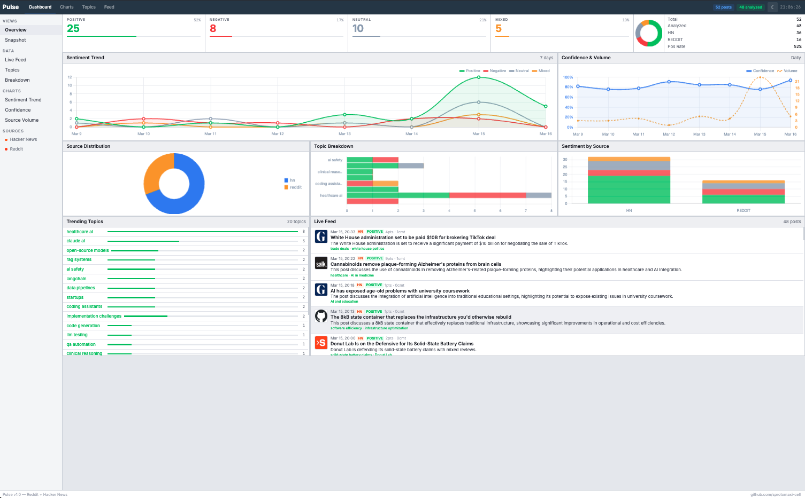
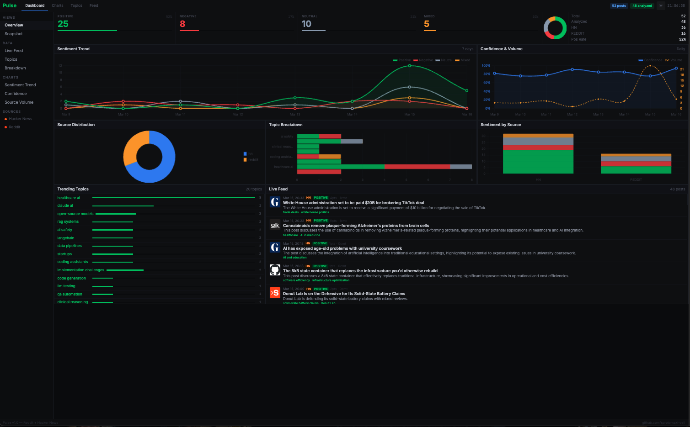

# Pulse

Real-time sentiment analysis of AI and health tech discussions across Reddit and Hacker News.

   

### Light Mode


### Dark Mode


## What it does

Pulse ingests public discussions from Reddit and Hacker News, classifies sentiment using local LLMs (Ollama) or Claude AI, and surfaces trends through a live dashboard. It tracks what people actually think about AI tools, health tech products, and developer platforms.

**Pipeline:**
1. **Ingest** — Async scrapers pull posts from target subreddits and HN (keyword-filtered)
2. **Analyze** — Ollama (local, free) or Claude Haiku classifies each post: sentiment, confidence, topics, one-line summary
3. **Visualize** — Flask dashboard with 6 interactive charts, sidebar navigation, and live feed

## Architecture

```
Reddit API ──┐
             ├── async pipeline ── Ollama / Claude ── SQLite ── Flask dashboard
HN API ──────┘
```

- **Async Python** throughout (aiohttp, asyncpraw)
- **Ollama** (qwen2.5:1.5b) as free local analysis engine, Claude Haiku as fallback
- **SQLite** with WAL mode for concurrent reads/writes
- **Chart.js** for interactive trend visualization
- **Day/night theme toggle** with localStorage persistence

## Dashboard

- **6 charts**: Sentiment Trend, Confidence & Volume, Source Distribution, Topic Breakdown, Sentiment by Source, Overview Donut
- **Sidebar navigation** with section links
- **Live feed** with favicons, sentiment badges, and topic tags
- **Key statistics** table with source breakdown
- **Responsive** down to mobile

## Quick Start

```bash
git clone https://github.com/sprotomaxi-cell/pulse-tracker.git
cd pulse-tracker
python -m venv .venv && source .venv/bin/activate
pip install -r requirements.txt
cp .env.example .env  # Add your API keys

# Run the pipeline
python pipeline.py

# Start the dashboard
python app.py  # http://localhost:5050
```

## API Endpoints

| Endpoint | Description |
|----------|-------------|
| `GET /api/overview` | Total posts, sentiment distribution, source counts |
| `GET /api/trends` | Sentiment by day (last 7 days) |
| `GET /api/topics` | Top 20 topics by frequency |
| `GET /api/topic-sentiment` | Sentiment breakdown per topic |
| `GET /api/confidence-trend` | Average confidence and volume by day |
| `GET /api/posts` | Recent 50 analyzed posts with metadata |

## Configuration

**For local analysis (free):**
- Install [Ollama](https://ollama.ai) and run `ollama pull qwen2.5:1.5b`

**For cloud analysis:**
- `ANTHROPIC_API_KEY` — for Claude sentiment analysis

**For Reddit ingestion:**
- `REDDIT_CLIENT_ID` / `REDDIT_CLIENT_SECRET` — [create app here](https://www.reddit.com/prefs/apps)
- HN ingestion works without auth

## Tech Stack

Python, Flask, aiohttp, asyncpraw, Ollama, Anthropic SDK, SQLite, Chart.js
